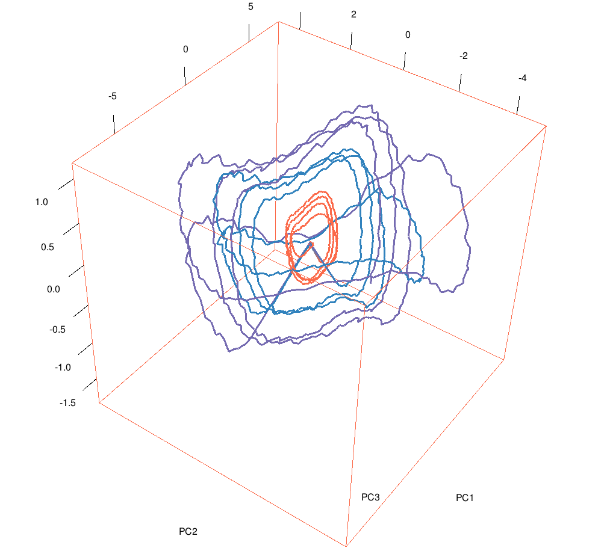

## About

The data set contains 58 time series acquired from 16 chemical sensors exposed to gaseous binary mixtures of acetone and ethanol at different concentrations.

Figure: PCA trajectories of the sensors' signals pre-processed by a high-pass filter (the first 4 respiration cycles). Trajectories for three gas classes are presented: acetone at 0.05 vol.% (orange), ethanol at 0.01 vol.% (violet) and their binary mixture (blue).

## Code examples

* R code: [examples/R](examples/R)

## Note

To be able to run the code, one needs to downloads the data files `rawdata.csv.gz` and `features.csv` from the UCI Machine Learning Repository website and save it to a local folder named `dat/`.
