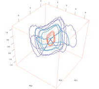

## About

The data set contains 58 time series acquired from 16 chemical sensors under a gas flow modulation. The sensors were exposed to gaseous binary mixtures of acetone and ethanol at different concentrations.

The data set is published the UCI Machine Learning repository, named as [Gas sensor array under flow modulation Data Set](https://archive.ics.uci.edu/ml/datasets/Gas+sensor+array+under+flow+modulation). 

This repository at github.com is intended to collect code examples (R, python, Matlab, etc)
for reproducible analysis applied to the published data.

Figure: PCA trajectories of the sensors' signals pre-processed by a high-pass filter (the first 4 respiration cycles). Trajectories for three gas classes are presented: acetone at 0.05 vol.% (orange), ethanol at 0.01 vol.% (violet) and their binary mixture (blue). See more details on [http://neurochem.sisbio.recerca.upc.edu/?p=311](http://neurochem.sisbio.recerca.upc.edu/?p=311).

## Code examples

* R code: [examples/R](examples/R)

## Note

To be able to run the code, one needs to download the data files `rawdata.csv.gz` and `features.csv` from the UCI Machine Learning Repository website and save them to a local folder named `dat/`.
