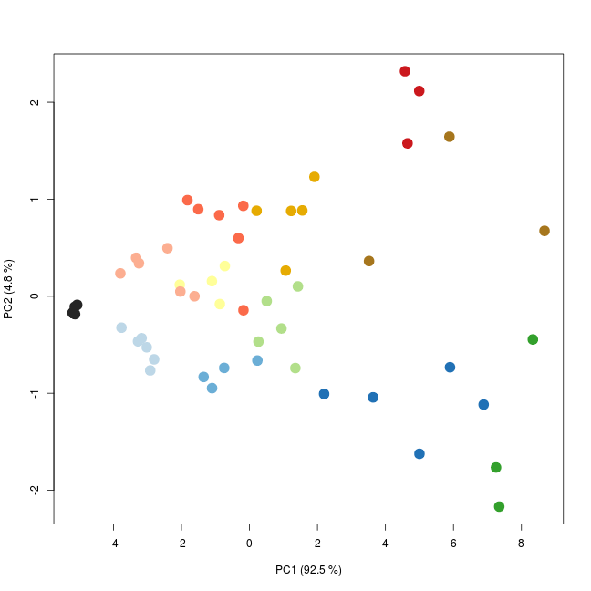

% Example on reading the raw data in R
% Andrey Ziyatdinov
% 08/09/2014


## About

This document shows an example of code in R,
in order to read the raw data `rawdata.csv.gz` of the `pulmon` data set published on 
[The UC Irvine Machine Learning Repository](http://archive.ics.uci.edu/ml/).

The `max` features are extracted from time-series trajectories one by one,
and a PCA on the resulted features is performed.
That reproduces the results obtained in [Ziyatdinov et al., 2014](http://www.journals.elsevier.com/sensors-and-actuators-b-chemical/),
Section 3.1, Figure 4 a.

## How to reproduce this report

The working directory:

```r
getwd()
```

```
## [1] "/home/andrey/git/variani/pulmon/examples/R/02-read-rawdata"
```

Run the following commands in R:

```
library(knitr)
knit2html("02-read-rawdata.Rmd")
```

That results in two output files: `*.md` (for github) and `*.html` (for browsing locally on your computer).

## Data files

For this report the data files are stored in:


```r
dat.dir <- "../../../dat"

list.files(dat.dir)
```

```
## [1] "features.csv"   "rawdata.csv.gz"
```

## Demo


```r
### inc
library(plyr)
library(reshape)
library(ggplot2)

library(pls)

### options
options(stringsAsFactors = FALSE)
```


```r
### data
t <- system.time({
  dat <- read.table(gzfile(file.path(dat.dir, "rawdata.csv.gz")), header = TRUE, sep = ",")
})
t
```

```
##    user  system elapsed 
##  18.829   0.084  19.058
```


```r
ind <- grep("dR", colnames(dat))
dRmax <- apply(dat[, ind], 1, max)

df <- data.frame(sensor = dat$sensor, sample = dat$sample, dRmax = dRmax)

cf <- cast(df, sample ~ sensor)
```


```r
### PCA
X <- cf[, -1] # remove `sample` column

Y <- subset(dat, sensor == 1, lab, drop = TRUE)

cols <- subset(dat, sensor == 1, col, drop = TRUE)
cols <- paste0("#", cols)

mod <- prcomp(X, center = TRUE, scale = TRUE)

### plot
scoreplot(mod, col = cols, pch = 20, cex = 3)
```

 
