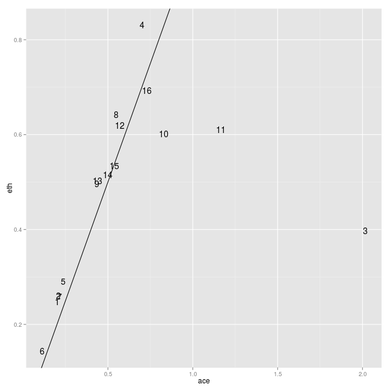

% Example on grouping the sensors in R
% Andrey Ziyatdinov
% 25/09/2014


## About

This document shows an example of code in R,
in order to read the `features.csv` of the `pulmon` data set published on 
[The UC Irvine Machine Learning Repository](http://archive.ics.uci.edu/ml/).

## How to reproduce this report

The working directory:

```r
getwd()
```

```
## [1] "/home/aziyatdinov/git/variani/pulmon/examples/R/03-group-sensors"
```


Run the following commands in R:

```
library(knitr)
knit2html("03-group-sensors.Rmd")
```

That results in two output files: `*.md` (for github) and `*.html` (for browsing locally on your computer).

## Data files

For this report the data files are stored in:


```r
dat.dir <- "../../../dat"

list.files(dat.dir)
```

```
## [1] "pulmon.sensors.RData"
```


One can change the path stored in `dat.dir` variable, if needed.

## Demo


```r
### inc
library(plyr)
library(ggplot2)

### options
options(stringsAsFactors = FALSE)
```


```r
### sensors' info
load(file.path(dat.dir, "pulmon.sensors.RData"))
```


```r
### data
dat <- read.table(file.path(dat.dir, "features.csv"), header = TRUE, sep = ",")
```

```
## Error: cannot open the connection
```


We are interested in `max` features.


```r
ind <- grep("_max", colnames(dat))
X <- dat[, ind]

Y <- dat$lab
```


Filter out two labels: `ace-0.3 and `eth-0.3`.


```r
Xace <- X[Y == "ace-0.3", ]
Xeth <- X[Y == "eth-0.3", ]
```


```r
df <- data.frame(sensor = 1:16,
  ace = apply(Xace, 2, mean),
  eth = apply(Xeth, 2, mean))
```


Plot affinity map.


```r
p1 <- ggplot(df, aes(ace, eth)) + geom_text(aes(label = sensor)) +
  geom_abline(a = 0, b = 1)
p1
```

 


## Compare with sensors' info


```r
pulmon.sensors
```

```
##     R ch act type volt Rload  class     col
## 1   1  5   5   10  5.0    21   10_5 #252525
## 2   2  2   2   10  5.0    21   10_5 #252525
## 3   3  1   1    2  5.0    21    2_5 #0C2C84
## 4   4 10  10    0  5.0    21    0_5 #006D2C
## 5   5  4   4   10  5.0    21   10_5 #252525
## 6   6 14  14   11  5.0    21   11_5 #49006A
## 7   7 15  15   10  5.0    21   10_5 #252525
## 8   8 12  12   20  5.0    21   20_5 #990000
## 9   9 11  11   10  3.3    82 10_3.3 #969696
## 10 10 13  13   20  3.3    82 20_3.3 #EF6548
## 11 11  3   3    2  3.3    82  2_3.3 #1D91C0
## 12 12  8   8   11  3.3    82 11_3.3 #AE017E
## 13 13  0   0   10  3.3    82 10_3.3 #969696
## 14 14  6   6   10  3.3    82 10_3.3 #969696
## 15 15  9   9   10  3.3    82 10_3.3 #969696
## 16 16  7   7    0  3.3    82  0_3.3 #74C476
```


One group of 4 sensors of type `10_5` (bottom-left corner on the figure):


```r
with(pulmon.sensors, R[class == "10_5"])
```

```
## [1] 1 2 5 7
```


Another group of 4 sensors of type `10_3.3` (center-left part of the figure):


```r
with(pulmon.sensors, R[class == "10_3.3"])
```

```
## [1]  9 13 14 15
```


